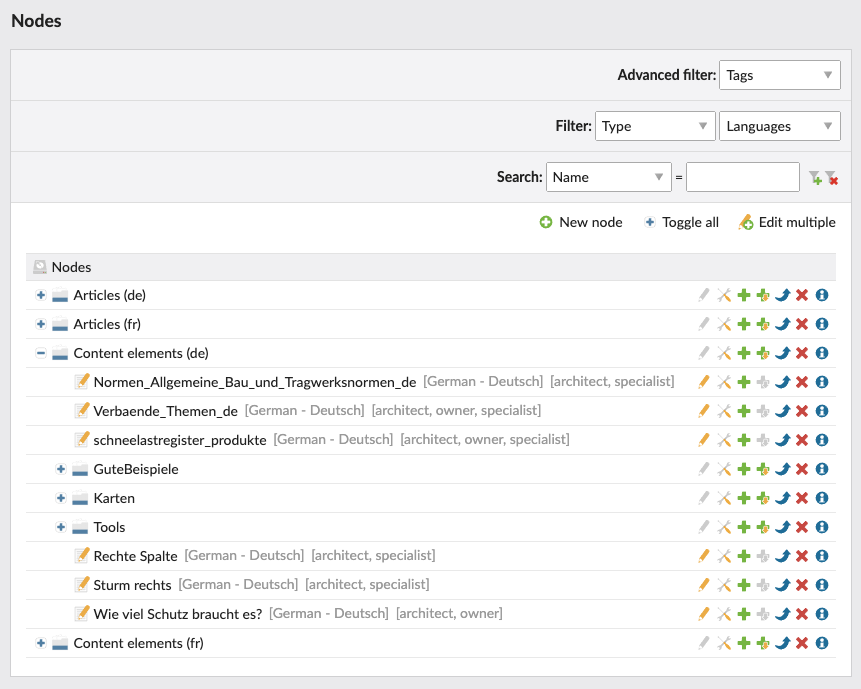

# Node bundle for Contao Open Source CMS

The extension provides a new way for Contao to manage content elements that are common for multiple pages.



## Installation

Install the bundle via Composer:

```
composer require terminal42/contao-node
```

## Configuration

Once installed, you can start creating groups and nodes in the `Content > Nodes` backend module. Roughly said they work
similar to articles – each node can have multiple content elements. 

You can then display those nodes in the front end using either `Nodes` front end module or content elements. 

To better organize nodes you can also use tags and languages. They don't have any influence on the front end, 
but can help you to manage your content in an efficient way.
